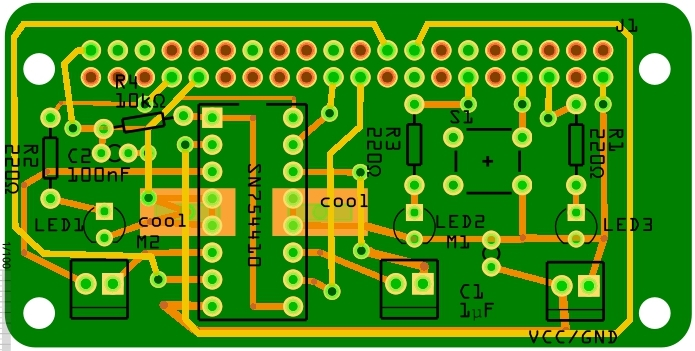

# Pi motorshield

Ein Motordrivershield für den Raspberry-Pi. Design im [erfindergarden](http://www.erfindergarden) münchen

Pinbelegung: Motoren 7,8,9, 10; LED 4,5, 19; Button 13, GND

Hier die einfache Version mit einseitiger Platine:

Pinbelegung: Motoren 3,4,9, 11

